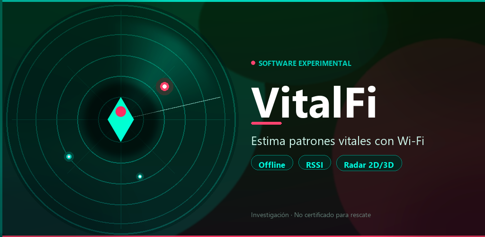
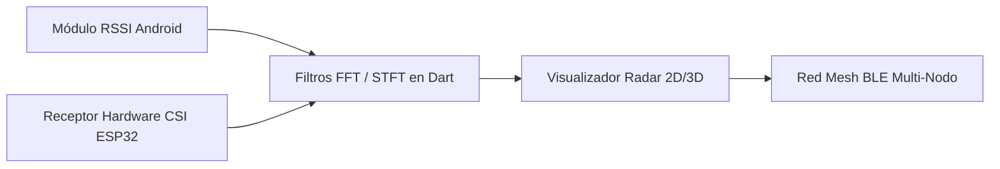

<div align="center">

  

  # VitalFi

  ### *Detección de Signos Vitales bajo Escombros mediante Análisis de Señales Wi-Fi*

  [](LICENSE)
  [](https://orcid.org/0009-0002-6152-0256)
  [](https://flutter.dev)
  []()
  [](CONTRIBUTING.md)
  [](CITATION.cff)

  ---

  

</div>

## 📌 Visión General del Proyecto

**VitalFi** es una aplicación experimental de investigación y prototipo de código abierto desarrollada en Flutter. Su objetivo principal es explorar el uso de las perturbaciones en el canal radioeléctrico Wi-Fi (fluctuaciones de RSSI y CSI) provocadas por micro-movimientos corporales y la frecuencia respiratoria humana, permitiendo estimar la presencia de personas atrapadas o sin conocimiento en escenarios de desastre, colapso de estructuras o escombros.

La aplicación opera **100% offline** directamente en dispositivos Android convencionales sin requerir servidores externos ni conexión a Internet.

> ⚠️ **Aviso de Responsabilidad:** VitalFi es un proyecto experimental de investigación científica y desarrollo tecnológico. **No sustituye** equipos certificados de búsqueda y rescate (USAR) ni protocolos médicos oficiales. Su uso está orientado a pruebas de laboratorio, prototipado y validación de campo.

---

## ⚡ Características Principales

- 📡 **Sensado Inalámbrico Non-Invasivo:** Análisis de variaciones dinámicas del entorno Wi-Fi (2.4 GHz).
- 📴 **Operación Offline Nativa:** Cero dependencia de servicios en la nube o infraestructura de red externa.
- ⏱️ **Calibración Automática del Entorno:** Proceso inicial (~30 segundos) para establecer la línea base de ruido del área.
- 🎯 **Estimación Vital Heurística:** Cálculo de un índice de confianza vital y tasa respiratoria en respiraciones por minuto (RPM).
- 🧭 **Visualización Radar 2D/3D:** Interfaz gráfica táctil para inspeccionar detecciones, profundidad estimada y vectores de proximidad.
- 📊 **Exportación de Datos para Análisis:** Soporte para registro de señales para validación académica.

---

## 🔬 Fundamento Científico y Algoritmo

Cuando una persona respira o realiza micro-movimientos en un área alcanzada por una señal Wi-Fi, la reflexión y dispersión de las ondas (efectos de *multipath*) sufren alteraciones periódicas.

$$\Delta \text{RSSI}(t) = f(\text{Respiración}, \text{Distancia}, \text{Estructura})$$

VitalFi captura estas variaciones espectrales para:
1. **Filtrar el ruido de fondo:** Aislación de interferencias térmicas y de canales vecinos.
2. **Transformada de Frecuencia (FFT/STFT):** Detección de frecuencias en el rango del ritmo respiratorio humano ($0.15 \text{ Hz} - 0.40 \text{ Hz} \iff 9 - 24 \text{ RPM}$).
3. **Estimación de Profundidad Heurística:** Atenuación de señal según la densidad estimada de los escombros.

Para profundizar en la base conceptual, consulta nuestro documento de [Trabajo Relacionado: WiHear (MobiCom 2014) y viabilidad en VitalFi](docs/TRABAJO_RELACIONADO_WIHEAR.md).

---

## 🗺️ Hoja de Ruta (Roadmap) y Áreas de Colaboración 🤝

¡Buscamos científicos, ingenieros de firmware, matemáticos y desarrolladores Flutter!



### 🎯 Tareas abiertas para colaboradores:
- [ ] **Integración de Hardware CSI (ESP32 / Wi-Fi CSI):** Implementar la recepción de matrices CSI completas (Amplitud y Fase) mediante microcontroladores ESP32 para superar la limitación del RSSI nativo de Android.
- [ ] **Optimización de Procesamiento en Dart:** Implementación eficiente de transformadas de Fourier y filtros pasabanda para procesamiento en tiempo real.
- [ ] **Renderizado de Radar 3D Avanzado:** Mejorar el motor gráfico del radar táctil usando `CustomPainter` o integración 3D.
- [ ] **Sincronización Mesh Multi-Dispositivo:** Red de escaneo coordinado entre varios teléfonos mediante Bluetooth Low Energy (BLE).
- [ ] **Recolección y Formateo de Datasets:** Pruebas en escenarios reales para crear un dataset abierto de variaciones Wi-Fi en colapsos.

Revisa nuestra [Guía de Contribución (CONTRIBUTING.md)](CONTRIBUTING.md) para sumarte al proyecto.

---

## 🛠️ Requisitos de Hardware y Entorno

### Hardware Recomendado
| Elemento | Especificación / Notas |
|----------|------------------------|
| **Dispositivo Móvil** | Smartphone Android (Android 8.0 / API 26 o superior) |
| **Emisor Wi-Fi** | Router o AP portátil convencional en la banda de **2.4 GHz** (mayor penetración de obstáculos) |
| **Opcional (Fase 2)** | Módulo ESP32 habilitado para extracción de CSI |

### Desarrollo con Flutter
- [Flutter SDK](https://flutter.dev) (`>=3.0.0`)
- Dart SDK
- Android SDK

```bash
# Verificar la instalación del entorno Flutter
flutter doctor
```

---

## 🚀 Inicio Rápido

```bash
# 1. Clonar el repositorio
git clone https://github.com/carlosmundaray/vitalfi_flutter.git
cd vitalfi_flutter

# 2. Instalar dependencias de Flutter
flutter pub get

# 3. Ejecutar en tu dispositivo Android conectado
flutter run

# 4. Compilar APK de prueba
flutter build apk --release
```

---

## 📚 Índice de Documentación Académica y Recursos

Toda la documentación técnica del proyecto está disponible en la carpeta [`docs/`](docs/):

- 📜 [Términos, Condiciones y Privacidad](docs/TERMINOS_Y_CONDICIONES.md)
- 📖 [Guía para Añadir VitalFi en ORCID](docs/ORCID_ADD_WORK.md)
- 🔬 [Ficha BibTeX para Importación Académica (`docs/vitalfi.bib`)](docs/vitalfi.bib)
- 📐 [Fórmula y Fundamento de Detección Vital (PDF)](docs/Formula_Deteccion_VitalFi.pdf)
- 🛠️ [Guía de Montaje de Sensores CSI (PDF)](docs/Montaje_CSI_VitalFi.pdf)
- 🛒 [Lista de Componentes Hardware CSI 2026 (PDF)](docs/Lista_Compra_CSI_2026.pdf)
- 📄 [Análisis del Paper WiHear MobiCom 2014 (PDF)](docs/WiHear_MobiCom14.pdf)

---

## 🎓 Cómo Citar este Proyecto

Si utilizas VitalFi o sus conceptos en tu investigación académica o desarrollos derivados, por favor cítalo utilizando la información de [CITATION.cff](CITATION.cff) o el siguiente bloque BibTeX:

```bibtex
@misc{vitalfi2026,
  author       = {Mundaray, Carlos and Correa, Angel},
  title        = {VitalFi: Wi-Fi-based life detection under rubble},
  year         = {2026},
  publisher    = {GitHub},
  journal      = {GitHub repository},
  howpublished = {\url{https://github.com/carlosmundaray/vitalfi_flutter}},
  url          = {https://github.com/carlosmundaray/vitalfi_flutter},
  note         = {Software prototype for Wi-Fi-based life detection and RSSI variation analysis}
}
```

---

## 👥 Autores y Licencia

- **Carlos Mundaray** — Autor Principal & Investigador — ORCID: [0009-0002-6152-0256](https://orcid.org/0009-0002-6152-0256)
- **Ing. Angel Correa** — Coautor y Asesor Técnico — GitHub: [@correangel](https://github.com/correangel)

Consulta [AUTHORS.md](AUTHORS.md) para ver la lista completa de colaboradores.

Este proyecto se distribuye bajo la licencia **GNU General Public License v3.0** — Ver [LICENSE](LICENSE) para más detalles.
